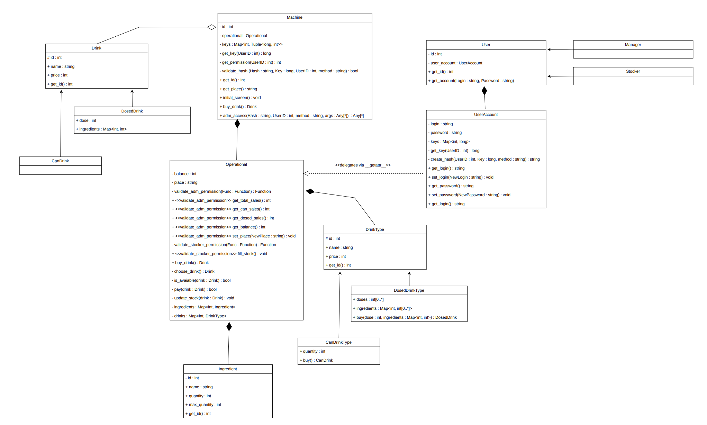

# ☕ Simulador de Máquina de Café e Multibebidas (POO)

[](https://www.python.org/)
[]()
[]()

## 📌 I. Introdução
Este projeto é uma aplicação desenvolvida em **Python** utilizando os conceitos de **Programação Orientada a Objetos (POO)**. O objetivo da atividade é simular o funcionamento completo de uma máquina automática de café e multibebidas não alcoólicas, aplicando conceitos de abstração, encapsulamento, herança e polimorfismo vistos em sala de aula.

A arquitetura do sistema foi modelada utilizando a linguagem UML (Unified Modeling Language), e a implementação foca na correta separação de responsabilidades entre as classes para gerenciar recursos, processar pagamentos e aplicar regras de negócio.

---

## ⚙️ II. Descrição do Sistema e Funcionalidades

A máquina é totalmente controlada por software e atende tanto clientes finais (venda de bebidas) quanto administradores (gerenciamento e reabastecimento). A parte mecânica (dispensadores) é simulada através de mensagens e interfaces de terminal.

### 🥤 Tipos de Bebidas
O sistema fornece dois tipos principais de produtos:

1. **Bebidas Dosadas (R$ 10,00):**
   * Bebidas quentes feitas sob demanda (ex: café, leite, açúcar).
   * Os ingredientes são liberados em um copo externo.
   * **Customização de Dose:** Cada porção base possui 10g, e o usuário pode escolher a dosagem exata desejada: **30%, 50%, 70% ou 100%**.
   * O estoque é deduzido baseando-se na quantidade de ingredientes (em pó/líquido) consumida por dose.

2. **Bebidas em Lata (R$ 5,00):**
   * Bebidas geladas prontas para consumo (ex: refrigerantes, sucos).
   * O estoque é contabilizado por unidade (lata).

### 💳 Formas de Pagamento
O sistema processa transações na moeda Real (R$) e suporta as seguintes modalidades simuladas:
* Pix
* Cartão de Crédito
* Cartão de Débito

### 🔒 Módulo Administrativo e Gerenciamento
A máquina possui controle de acesso corporativo dividido por níveis de permissão:
* **Gerente (`Manager`):** Controla o balanço financeiro, visualizando o valor total arrecadado, vendas de bebidas dosadas e vendas de latas.
* **Estoquista (`Stocker`):** Responsável por acessar o sistema e realizar o abastecimento manual da máquina (inserção de latas e reabastecimento de ingredientes em pó).
* *Nota:* A atualização de saldos e a dedução de insumos ocorrem de forma automática durante o funcionamento operacional de vendas.

---

## 🏗️ Arquitetura e Diagrama de Classes

A estrutura do código foi projetada para garantir baixo acoplamento e alta coesão. Abaixo está o Diagrama de Classes UML que norteia a implementação:



### Principais Componentes:
* **`Machine` & `Operational`:** O núcleo do sistema. A classe `Machine` atua na gestão de sessão e controle de acesso (validação de hash/permissões), delegando as regras de negócio de estoque, balanço financeiro e vendas para a classe `Operational`.
* **Hierarquia de Bebidas (`Drink` e `DrinkType`):** O projeto separa o conceito do "tipo" de bebida (receita/modelo) da "bebida instanciada" (o produto final vendido). Subclasses gerenciam as particularidades de `DosedDrink` (ingredientes fracionados) e `CanDrink` (unidades inteiras).
* **`Ingredient`:** Rastreia o nível de insumos internos da máquina (quantidade atual vs. capacidade máxima).
* **Controle de Usuários (`User`, `Manager`, `Stocker`, `UserAccount`):** Estrutura de herança para garantir que apenas pessoas autorizadas possuam acesso aos métodos restritos de `Operational` (como `fill_stock()` e emissão de relatórios de vendas).

---

## 🚀 Como Executar o Projeto

**Pré-requisitos:** Python 3.8 ou superior instalado.

1. Clone o repositório para sua máquina local:
   ```bash
   git clone https://github.com/rmarmac/Maquina-de-Cafe.git